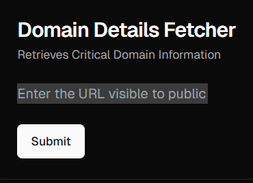
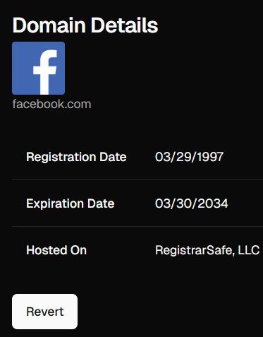

---

## About Domain Scope

### Introduction

DomainScope is a web application built for tracking critical domain information of websites.

### Features

#### Website Input Card

#### Display Card

Following critical information will be displayed :-
 <ul>
   <li>Registration Date</li>
   <li>Expiration Date</li>
   <li>Hosted Platform</li>
 </ul>

  

 

---

### Tech Stack
<ul>
 <li>Next.js</li>
 <li>Tailwind CSS</li>
 <li>TypeScript</li>
 
</ul>
